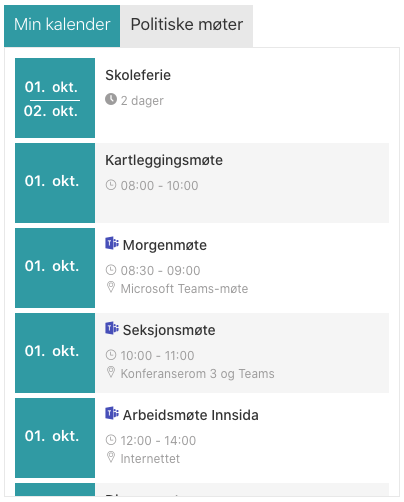
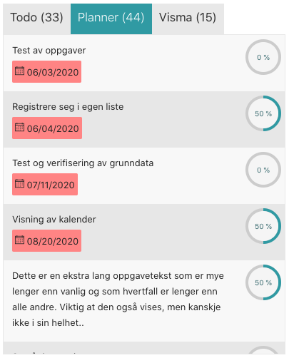

# valo-handlebar-templates

Templates for the "Valo - Universal" web part used on our intranet, ___Innsida___. 

"Valo - Universal" uses handlebars to dynamicly generate the web parts, with API data from any source. These templates/web parts is only tested and verified to work with Valo Intranet on Sharepoint Online.

## Templates

### Calendar Event Tabs

#### Description

The universal calendar event tab web part generates dynamic tabs based on data from the [azf-calendar-api](https://github.com/vtfk/azf-calendar-api). The Azure function gets the events from Microsoft Graph (using the users access token), and uses this template displays it on the intranet.

#### Links:
:link: &nbsp;&nbsp; __Handlebars Template:__ [calendar/CalendarEventTabs.html](calendar/CalendarEventTabs.html) 
:link: &nbsp;&nbsp; __Azure functions API:__ [azf-calendar-api](https://github.com/vtfk/azf-calendar-api) 

### Task Event Tabs

#### Description

This web part displays tasks from different sources to the end user. Gets data from Azure function [azf-tasks-api](https://github.com/vtfk/azf-tasks-api), that collects the tasks from Planner, To Do, Visma, (and Public 360), so the users don't have to check for tasks in the business applications self.

#### Links:
:link: &nbsp;&nbsp; __Handlebars Template:__ [tasks/TasksTabs.html](tasks/TasksTabs.html) 
:link: &nbsp;&nbsp; __Azure functions API:__ [azf-tasks-api](https://github.com/vtfk/azf-tasks-api) 

## Questions?

Please [create an issue here](https://github.com/vtfk/valo-handlebar-templates/issues), if you have any questions, concerns, or issues.

## License

[MIT](https://github.com/vtfk/valo-handlebar-templates/blob/master/README.md)
